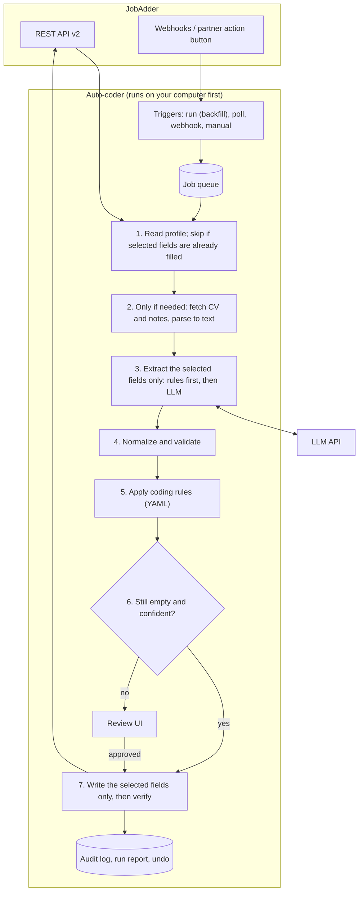

# JobAdder Auto-Coder: Ideation

> **Status:** Draft for discussion · **Date:** 2 Oct 2026 (updated the same day with your answers) · **Drafted by:** Claude · **Decision owner:** you
>
> ChatGPT is drafting ideas in parallel. Put both drafts side by side and record what you pick in the [Decision log](#11-decision-log). Anything the two drafts disagree on becomes an [open question](#12-open-questions-for-you).

### ✅ Confirmed by you
1. **Access:** you have JobAdder API access and are an admin.
2. **What a run does:** the app goes through **all** profiles and fills in **only missing values**, and **only for the fields you select** for that run. If you select only *Country*, only Country is ever written and every other field is left untouched. See [§1.5](#15-how-a-run-works) and [§5.9](#59-guarantee-only-the-selected-fields-only-when-empty).
3. **Scale:** about **200,000 profiles**. See [§2.1](#21-what-200000-profiles-means).

---

## TL;DR: the proposed direction

| Topic | Proposal |
|---|---|
| **What** | An app that goes through every candidate profile in JobAdder and **fills in missing values for the fields you pick** (for example only Country). It finds each value in the record, the CV or the notes, converts it to *your* JobAdder fields and picklists, and writes it back. It never touches fields you didn't pick or values that are already filled. Confident values can be filled automatically; the rest go to a review screen. |
| **Scale** | About 200k profiles. Start with a cheap, **read-only gap report** that counts what's missing. After that, process only the profiles that are missing a selected field, and use fixed rules before calling the LLM. The backlog goes through the Batch API, with a speed limit so JobAdder stays usable for everyone else. |
| **Where it runs** | On your computer first (a local web app at `http://localhost`). A 200k backfill takes hours to days, so the big runs belong on a machine that stays on, or on a small cloud server. |
| **JobAdder access** | The **official JobAdder REST API (v2)** with OAuth 2.0, not screen-scraping. You already have access. Next: register the app to get a client ID and secret, and confirm how JobAdder's update call behaves (see [§5.9](#59-guarantee-only-the-selected-fields-only-when-empty)). |
| **Language** | **Python** for everything in the MVP (FastAPI, Pydantic, SQLite and a review UI that the server renders). Add TypeScript only if we later build a browser extension. |
| **Architecture** | A **modular monolith** (one codebase with clear internal modules) plus a job queue: *fetch → parse → extract → normalize → apply coding rules → decide → write back → audit*. To scale, add workers and switch SQLite to Postgres. Microservices aren't needed. |
| **Extraction** | Fixed rules for predictable data (emails, phones, URLs). An **LLM with a strict JSON schema** for messy text (notice periods, salary, work rights, location). Every value carries a confidence level and a **verbatim evidence quote** that the code checks against the source. |
| **Safety** | **Only selected fields, only when empty. Nothing is ever overwritten.** Every run starts as a preview that writes nothing. Auto-fill is switched on one field at a time, once accuracy on a hand-checked sample proves it. After every write, the app re-reads the record to confirm nothing else changed. Every run can be undone. |
| **Roles** | **You:** product owner and final approver. **Claude:** Track A, the extraction pipeline. **ChatGPT:** Track B, the JobAdder integration and the UI. Each assistant reviews the other's pull requests. |

---

## 1. What we're building

### 1.1 Problem
Candidate profiles in JobAdder are often half-filled or inconsistent. The useful facts are buried in CV attachments, notes and application answers ("4 weeks' notice", "looking for 140 + super", "based in Auckland, moving to Sydney in March"). Filling and tidying these fields by hand ("coding" the candidate) is slow and inconsistent, so search and shortlisting suffer.

### 1.2 Goal
Go through all ~200k profiles (the backlog), and later new or updated candidates as they come in. **Fill in the missing values for the fields you choose**, in your format, with an audit trail and a person in control. Existing values are never changed.

### 1.3 Non-goals (deliberately out of scope)
- **Scoring, ranking or rejecting candidates.** This tool does data entry, not hiring decisions. That keeps compliance simple (see [§7](#7-security-privacy-and-compliance)).
- Inferring anything the candidate didn't say: nationality, age, ethnicity, gender or health.
- Changing or tidying values that already exist. A run only fills **empty** fields. Tidying could be a separate, opt-in kind of run later.
- Replacing JobAdder or its built-in CV parsing. We fill the gaps and enforce *your* coding conventions.

### 1.4 Fields you can pick from (first cut; you choose which ones appear in the selector)

| Field | Typical sources | Normalized form | Gotchas |
|---|---|---|---|
| **Name** (first, last, preferred) | Record, CV header, email signature | Written as on the CV, keeping particles such as *van der*, *O'Brien* and *McDonald*; used only when the name is missing | Fixing the case of *existing* names (for example ALL CAPS) would be an overwrite, so it's out of scope for now. It could become a separate opt-in "tidy-up" run. |
| **Email** | Record, CV, application | Lowercase and syntax-checked; primary vs. secondary | Several addresses per person, work addresses, the same email on two candidates (duplicates) |
| **Phone** | CV, record | E.164 format (`+61412345678`) | No country code: infer it from the country, otherwise flag it |
| **Country / location** (where they live) | Address, phone prefix, latest job, CV header | ISO 3166 code (`AU`) + state + city | Where they live ≠ nationality ≠ right to work. **Never infer nationality.** |
| **Work rights / visa** | CV statement, notes | Picklist: Citizen / PR / Visa (type) / Needs sponsorship / Unknown | Only code what the candidate explicitly stated |
| **Notice period / availability** | Notes, CV, application answers | `immediate`, or `{amount, unit}`, or an `available_from` date, plus `days` for grouping | "1 month" vs. "4 weeks", "negotiable", contract end dates, out-of-date info |
| **Current salary** | Notes, screening-call summaries, sometimes the CV | `{min, max, currency, period, basis}` | Is "$120k" AUD? Base vs. package; "+ super" vs. "incl. super" |
| **Expected salary / rate** | Notes, application questions | Same as above | Ranges ("130–150"), "k", day vs. hourly rate, "+GST", inside or outside IR35 |
| **Current title / employer** | Latest role on the CV | Text + optional seniority band | Overlapping roles; stale CVs |
| **Work type sought** | Notes, CV summary | Perm / Contract / Temp / Any | |
| **Skills / category tags** | CV | Mapped to **your** JobAdder skill tags and categories | Skills are an open-ended list, so they have to be mapped to a fixed list |

> **Freshness matters.** A salary from a CV dated 2023 is not today's salary. Store the date of every source and prefer the newest source. Anything older than a set age (for example 6 months) goes to review as **stale**.

### 1.5 How a run works
A **run** is one pass over your profiles with settings you choose on one screen:

| Setting | Choices | Example |
|---|---|---|
| **Fields** | Tick boxes for the fields in §1.4 | ☑ Country ☐ Notice period ☐ Salary … |
| **Profiles** | All, or a filter (updated in the last N months, a status, a recruiter, a saved search) | All 200k |
| **Mode** | **Preview** (writes nothing; shows what *would* be filled) → **Review** (you approve values one by one or in bulk) → **Auto-fill** (confident values are written, the rest go to review) | Preview first |
| **What counts as "missing"** | Truly empty only, or also placeholders such as `N/A`, `-`, `TBC`, `Unknown` | Empty only |

What happens to each profile:
1. **Skip** it straight away if every selected field already has a value. Every profile that ends here costs one cheap read and no AI. The gap report tells us how many that is.
2. Otherwise, look for the value in the **record first** (for example, Country from the address or the phone number's country code). That uses no AI and needs no CV download.
3. Only if that fails, read the **CV and notes**, and ask the LLM **only for the selected fields**.
4. Fill **only the empty selected fields**: straight away in Auto-fill mode, or after approval in Review mode.
5. At the end, a **run report** shows how many profiles were filled, skipped, sent to review or found to have no information. An **undo** clears exactly the values this run wrote, provided nobody has edited them since.

---

## 2. Constraints and assumptions

- **Single user at first** (you), on Windows or Mac, with a normal internet connection.
- **API access: confirmed.** You have access and admin rights. We still need a registered app (client ID and secret) and a redirect URL that works for a local app. Until then, development uses recorded or fake API responses.
- **The bottleneck is API limits, not computing power.** JobAdder rate-limits each account, and LLM APIs have throughput limits. "Scalable" therefore means queueing, retries, back-pressure and resumability more than raw speed.
- **Candidate data is personal information.** Privacy law applies (see [§7](#7-security-privacy-and-compliance)).
- **Two AI assistants and one owner build this.** Fewer languages, clear module boundaries and agreed interfaces (contracts) matter more than usual.

### 2.1 What 200,000 profiles means
**Start with the gap report.** Before any AI spend, the app reads every profile (read-only) and counts, for each field, how many values are missing. It also counts how many profiles have a CV and how many could be filled from the record alone. That turns the estimates below into real numbers, and it tells you which field to do first.

**The funnel:**

| Stage | Profiles | What it costs |
|---|---|---|
| All profiles | ~200,000 | JobAdder reads only (the gap report) |
| Missing at least one selected field | *gap report tells us* | — |
| Fillable from the record itself (no CV, no AI) | *gap report tells us* | JobAdder reads only |
| Needs the CV or notes plus the LLM | *gap report tells us* | CV downloads + LLM |
| No usable information anywhere | *gap report tells us* | Marked "not found", so they aren't retried every run |

**LLM cost, worst case** (all 200k profiles need the LLM). This assumes about 3,000 input tokens and 600 output tokens per profile when asking only for the selected fields. Prices are US$ list prices per million input / output tokens, Oct 2026. Treat the estimates as ±2× until a pilot measures real CV sizes.

| Model tier | Price (in / out) | Per profile | 200k at standard rates | 200k via Batch API (−50%) |
|---|---|---|---|---|
| Opus (default for accuracy) | $4 / $20 | ~$0.024 | ~$4,800 | **~$2,400** |
| Sonnet | $2 / $10 | ~$0.012 | ~$2,400 | **~$1,200** |
| Haiku | $1 / $5 | ~$0.006 | ~$1,200 | **~$600** |

The real bill will be lower: profiles that are already complete, or that can be filled from the record, never reach the LLM. Choosing a cheaper tier is **your call**, made once the golden-set accuracy for that tier is known (see [§6](#6-llm-approach)).

**Time.** JobAdder's rate limit is the real clock. A rough count of calls: one read per profile (fewer if search pages already include the fields), about three more per profile that needs its CV (attachment list, download, notes) and one per write. For example, 200k reads + 100k CV lookups × 3 + 100k writes ≈ **600k calls**:

| Allowed rate (illustrative; we'll measure the real one) | Time for ~600k calls |
|---|---|
| 1 call/second | ~7 days |
| 5 calls/second | ~33 hours |

**What this means in practice:**
- **Share the limit politely.** The limit is per JobAdder account and is shared with your other integrations (job boards, email plugins). The app throttles itself, for example to half the allowance, and can be scheduled for nights and weekends.
- **Resumable by design.** A multi-day run must survive restarts, sleep and network drops, and continue exactly where it stopped. Run it on a machine that stays on, or on a small cloud server.
- **Storage.** Keep extracted text only, not original CV files: roughly 10 KB per profile, so at most about 2 GB. Delete it after the retention period.
- **Recent candidates first for time-sensitive fields.** Notice period and salary from a 2019 CV are meaningless, so limit those fields to recently active candidates (for example updated in the last 12 months). Country can be backfilled across the whole database, with old sources flagged.
- **Start with Country.** It can often be filled from the address or phone number with no AI at all. It's objective, easy to check, and the best field to prove the whole loop on.

---

## 3. Getting data in and out of JobAdder

### 3.1 Options

| Option | How | Pros | Cons | Verdict |
|---|---|---|---|---|
| **A. Official REST API (v2)** | Register an app in a JobAdder developer account and use the OAuth 2.0 authorization-code flow | Supported and stable; reads and writes; webhooks; nothing scraped from screens | Needs developer-account approval; rate limits | ✅ **Recommended** |
| **B. No-code tools (Zapier / Make) + an LLM step** | Use their ready-made JobAdder connectors | A prototype in a day, nothing to host | Limited triggers and fields; priced per task; no proper review screen or audit trail; poor for a backlog of thousands | 🟡 Optional throwaway prototype |
| **C. Browser automation of the JobAdder screens** (Playwright) | A robot clicks through the screens | No API approval needed | Breaks whenever the UI changes; likely breaches the terms of service; stores your login; slow; risky at scale | ❌ **Avoid** |

### 3.2 What we know about the API (verify everything in the official docs once we have access)
- **Auth:** OAuth 2.0 authorization code. Endpoints: `https://id.jobadder.com/connect/authorize` and `https://id.jobadder.com/connect/token`. Access tokens last about 60 minutes. The `offline_access` scope returns a refresh token. **The API base URL is region-specific and comes back with the token**, so don't hard-code it.
- **Scopes:** `read`, `write` and `offline_access`, plus finer-grained scopes such as `read_candidate`. Ask for the least access that works.
- **Resources:** candidates (search, read, update), attachments (CVs), notes, custom fields, jobs, applications, placements, plus reference lists (picklists).
- **Webhooks:** created through the API for each JobAdder account. The candidate events we found are `candidate_updated`, `candidate_status_changed`, `candidate_skill_updated` and `candidate_partner_action`. **No "candidate created" event** turned up in what we found, so new candidates need polling or a sweep (confirm the full list in the docs).
- **Partner action buttons:** JobAdder supports buttons on records that call a partner app. A button such as **"Auto-code this candidate"** on the candidate screen would be the best user experience. Check whether your account or app qualifies.
- **Rate limits:** set per account. Treat HTTP `429` as "back off and retry", page through large lists, and never fetch everything at once.

### 3.3 Triggers (how work gets into the queue)
1. **Run (backfill sweep):** page through all candidates (or a filtered set), newest first, saving progress so it can resume after a stop. This is how the ~200k backlog is processed (see [§1.5](#15-how-a-run-works)).
2. **Polling:** every N minutes, ask for candidates updated since the last check. Works on a laptop with no public URL. **The default for the MVP.**
3. **Webhooks:** close to real time, but JobAdder needs a public HTTPS address to send them to (a tunnel or a small cloud server). **Ignore `candidate_updated` events caused by our own write-backs**, or the app will loop forever.
4. **Partner action button:** a recruiter clicks it on a profile and that profile is processed immediately.
5. **Manual:** paste a candidate ID or URL into the app.

---

## 4. Programming language

### 4.1 Comparison (●●● = strong)

| Criterion | **Python** | TypeScript / Node | C# / .NET | Go |
|---|---|---|---|---|
| LLM SDKs and AI tooling | ●●● | ●●● | ●●○ | ●●○ |
| CV parsing (PDF, DOCX, OCR) | ●●● | ●●○ | ●●○ | ●○○ |
| Data clean-up libraries (phones, countries, currencies, dates) | ●●● | ●●○ | ●●○ | ●●○ |
| Web API and background jobs | ●●○ | ●●● | ●●● | ●●● |
| Desktop or browser UI | ●●○ | ●●● | ●●● (Windows) | ●○○ |
| Readable for a non-developer owner; both AI assistants write it well | ●●● | ●●● | ●●○ | ●●○ |
| Running it on your computer | ●●○ (`uv` makes it easy) | ●●○ | ●●● | ●●● (single binary) |

### 4.2 Recommendation: **Python 3.12+, one language for the MVP**
- Python has the best tools for the hard part, which is turning CVs into structured data.
- One language means fewer integration bugs between Claude's and ChatGPT's code, and each assistant can review everything.
- The review UI is rendered on the server (**FastAPI + Jinja2 + HTMX**), so there's no separate JavaScript build. If the UI outgrows that, or we build a **Chrome side panel** that sits next to JobAdder, we add TypeScript then.

### 4.3 Stack

| Concern | Choice | Why |
|---|---|---|
| Runtime and packaging | Python 3.12+, `uv` | One-command setup on Windows and Mac |
| Web app and API | FastAPI | Async, type-checked, auto-generated API docs |
| Schemas | Pydantic v2 | **One model** is the LLM output schema, the validation rules and the API contract |
| HTTP client | httpx + tenacity | Async calls, retries with backoff, `429` handling |
| Database | SQLite → Postgres via SQLAlchemy 2 + Alembic | Zero setup locally; the same code works on Postgres later |
| Queue | A job table in the database at first → Redis/RQ or a cloud queue later | Behind an interface, so it can be swapped without touching the pipeline |
| Document parsing | pypdf / pdfplumber, python-docx, LibreOffice (headless) for `.doc`/`.rtf`, OCR or a PDF-to-LLM fallback | Covers the CV formats people actually send |
| Data normalization | phonenumbers, pycountry, babel (currencies), email-validator, dateparser | Proven libraries, so we don't hand-write regular expressions |
| UI | Jinja2 + HTMX (+ a small CSS framework) | Fast to build; no frontend build step |
| Secrets | `keyring` (Windows Credential Manager / macOS Keychain) | OAuth tokens never sit in plain files or git |
| Quality | pytest, ruff, mypy or pyright, GitHub Actions | Every PR is checked automatically |

---

## 5. Architecture

### 5.1 Principles
1. **Modular monolith first.** One codebase with clear module boundaries. Scale by running more workers, not by splitting into services.
2. **Only the selected fields, only when empty.** A run never reads for, suggests or writes any other field, and it never overwrites a value. Runs go preview → review → auto-fill, and nothing reaches JobAdder without passing the decision policy.
3. **Every value has evidence:** the source document, a verbatim quote, a confidence level and the source date.
4. **Fixed rules first, LLM second.** Use libraries for predictable patterns and the LLM only for fuzzy text.
5. **Configuration, not code.** Field mappings, picklists, groupings and auto-fill thresholds live in versioned YAML files.
6. **Safe to re-run and resumable.** Re-running on unchanged input changes nothing, and after a crash the app continues from where it stopped.
7. **Ready for more than one JobAdder account.** Every row carries an `account_id`, so a second account is a configuration change.

### 5.2 Overview



### 5.3 Components

| # | Component | Responsibility | Key tech |
|---|---|---|---|
| 1 | **JobAdder connector** | OAuth (tokens kept in the OS keychain and refreshed automatically), a typed client, paging, rate limiting, a webhook receiver | httpx, tenacity |
| 2 | **Triggers / scheduler** | Backfill sweep, polling cursor, webhook and partner-action intake, manual requests | Simple scheduler loop |
| 3 | **Job queue** | A durable list of "process candidate X" jobs with retries, duplicate removal and priorities | Database table → Redis |
| 4 | **Document parser** | PDF, DOCX, DOC or RTF → clean text with section hints; fallback for scanned CVs | pdfplumber, python-docx, LibreOffice |
| 5 | **Extractors** | (a) fixed rules: email, phone, URLs; (b) LLM extraction against a schema, with evidence | phonenumbers, LLM SDK |
| 6 | **Normalizer and validators** | ISO codes, currencies, periods, notice → days, sanity ranges | pycountry, babel, dateparser |
| 7 | **Coding rules engine** | Maps normalized facts to *your* JobAdder fields, picklists and tags | YAML + Pydantic |
| 8 | **Decision policy** | Auto-fill or send to review, based on confidence, whether the field is still empty, staleness and per-field settings | YAML |
| 9 | **Write-back** | Writes **only the selected fields that are still empty**, with a key that prevents duplicate writes; re-reads the record afterwards and stops the run if anything else changed (see [§5.9](#59-guarantee-only-the-selected-fields-only-when-empty)) | Connector |
| 10 | **Review UI** | Queue, evidence beside each suggestion, accept / edit / reject, bulk approve, settings | FastAPI + HTMX |
| 11 | **Audit and metrics** | Before and after values; who, what and when; pipeline, prompt and model versions; reviewer corrections, which give the real accuracy | Database + structured logs |
| 12 | **Eval harness** | A golden set (profiles hand-coded by you) and per-field precision and recall; CI blocks changes that make accuracy worse | pytest |
| 13 | **Gap report and run reports** | Missing values per field across all profiles, CV coverage, projected cost and time; per-run results (filled, skipped, review, not found) with undo | Database + UI |

### 5.4 The contract between components (agree on this first)
Everything downstream works with **field suggestions**. Track A (the pipeline) produces them and Track B (the integration and UI) consumes them, so both sides can be built and tested independently. A field that wasn't selected for the run never appears in `fields`:

```json
{
  "candidate_id": 12345,
  "run": { "id": "run-0007", "selected_fields": ["notice_period", "salary_expected"], "mode": "review" },
  "pipeline_version": "0.3.0",
  "fields": {
    "notice_period": {
      "raw": "4 weeks' notice",
      "value": { "immediate": false, "amount": 4, "unit": "week", "days": 28, "available_from": null },
      "confidence": "high",
      "source": "llm",
      "evidence": { "document": "CV_2026-08.pdf", "document_date": "2026-08-14", "quote": "Notice period: 4 weeks" }
    },
    "salary_expected": {
      "raw": "looking for 140 + super",
      "value": { "min": 140000, "max": 140000, "currency": "AUD", "period": "year", "basis": "base_plus_super" },
      "confidence": "medium",
      "source": "llm",
      "evidence": { "document": "note:98765", "document_date": "2026-09-30", "quote": "looking for 140 + super" }
    }
  }
}
```

### 5.5 Coding rules (configuration, illustrative)

```yaml
# config/coding_rules.yaml
notice_period_band:
  target: custom_field:"Notice Period"     # JobAdder picklist
  from: notice_period.days
  bands:
    - { max: 0,  value: "Immediate" }
    - { max: 14, value: "Up to 2 weeks" }
    - { max: 31, value: "Up to 1 month" }
    - { value: "More than 1 month" }

salary:
  default_currency_by_country: { AU: AUD, NZ: NZD, GB: GBP, SG: SGD }
  super_rate: 0.12            # AU Superannuation Guarantee from 1 Jul 2025; config, not code

auto_fill:                    # everything starts false; switch on per field once accuracy is proven
  email:         { enabled: false, min_confidence: high }
  country:       { enabled: false, min_confidence: high }
  notice_period: { enabled: false, min_confidence: high, max_source_age_days: 180 }
  salary:        { enabled: false }
# "only when empty" is not a setting: it is always on and can't be switched off.
```

A run's settings (chosen on the run screen, saved with the run so it can be audited and undone):

```yaml
run:
  fields: [country]                 # the ONLY fields this run may read for or write
  profiles: { updated_within_days: null, status: any }   # null = all ~200k
  mode: preview                     # preview | review | auto_fill
  treat_as_empty: [""]              # optionally add "N/A", "-", "TBC", "Unknown"
  throttle: { max_share_of_rate_limit: 0.5, schedule: "nights_and_weekends" }
```

### 5.6 Decision policy

| Situation | Action |
|---|---|
| Field **not selected** for this run | Never read for, suggested or written |
| Selected field **already has a value** (any value) | Skip it. **Never overwritten.** |
| Selected field empty, high confidence, validators pass, auto-fill on for that field | **Auto-fill** |
| Selected field empty, medium or low confidence, or auto-fill off | Review queue |
| Selected field empty but someone filled it while the run was going | Skip it (checked again just before writing) |
| Source older than the field's freshness limit | Review, flagged *stale* |
| Validation fails (salary of 1,400,000 a year, notice of 52 weeks, an email on a disposable domain) | Review, flagged |
| Nothing found in the record, CV or notes | Mark "not found" with the date; don't retry until the profile or its documents change |

### 5.7 Data model (main tables)
`accounts` · `candidates` (snapshot + hash) · `documents` (hash, type, date, where the text is stored) · `runs` (selected fields, mode, filters; pipeline, prompt and model versions; progress cursor; tokens and cost) · `suggestions` (field, raw, normalized, confidence, evidence, status) · `reviews` · `writebacks` (before/after per field, for undo) · `not_found` (field, candidate, date) · `audit_events` · `sync_state` (cursors)

**Re-run guard:** if a candidate's document hashes and the pipeline version haven't changed since the last run, skip it. Profiles marked "not found" are skipped the same way.

### 5.8 How it scales

| Stage | Users | Where it runs | Database and queue | Triggers |
|---|---|---|---|---|
| **1. Local MVP** | You | Your computer (`localhost`) | SQLite; one worker inside the app | Manual + backfill |
| **2. Always on** | You plus 1–2 people | Your computer or a small server, with a tunnel for webhooks | SQLite or Postgres; a separate worker process | + polling, webhooks, partner button |
| **3. Team / several accounts** | A team | Containers in the cloud (pick an AU/UK/EU region to suit your privacy obligations) | Postgres + Redis; N workers | All, plus logins and user roles |

The code is the same at every stage. Only configuration and deployment change.

### 5.9 Guarantee: only the selected fields, only when empty
This is the promise behind "if I select only Country, the rest you don't touch". It's enforced in five layers, so a bug in one layer can't break it:

1. **Extraction asks only for the selected fields.** The LLM schema is built from the run's field list, so other fields are never even produced. (This also makes calls cheaper.)
2. **Re-check just before writing.** The app re-reads the candidate right before the write. If the field now has a value, it skips it.
3. **Minimal write.** The update contains only the selected fields that are still empty.
   > ⚠️ **To verify first:** does JobAdder's candidate update accept a partial change, or does it replace the whole record? If it's a full replace, the app copies every other field unchanged from the fresh read in step 2. This is the main technical risk for the promise, so it gets tested before the first real write.
4. **Verify after writing.** The app re-reads the record and compares it with the version from step 2. If anything other than the selected fields changed, it **stops the run and alerts you** (a circuit breaker).
5. **Audit and undo.** Before and after values are stored per field and per run. Undo puts back the empty value for exactly what that run wrote, but skips any field someone has edited since.

**Before the first real run:** test on a JobAdder test account if you have one. If not, test on a handful of dummy candidates created for the purpose.

---

## 6. LLM approach

- **Model:** the Claude API, with the **Opus-tier model as the default** for accuracy. Set the "effort" level explicitly; start at low or medium, because extraction is a narrow task, and measure. Cheaper tiers (Sonnet, Haiku) are a cost decision **for you**, once the golden-set eval shows whether they hold accuracy.
- **Structured outputs:** the API is given a JSON schema generated from the same Pydantic model the app uses, so every response parses. The code still checks the business rules.
- **Evidence check (guards against made-up values):** each field returns a verbatim quote, and the code confirms the quote really appears in the source text (ignoring differences in spacing). No match means review. The API's built-in citations feature can't be used together with structured outputs, which is why the check lives in our code.
- **Text first, PDF as fallback:** extract the text locally and send that. Send the original PDF only for scanned or oddly laid-out CVs, because the API then reads page images too, which uses more tokens.
- **Contact details masked:** emails and phone numbers are extracted locally, so they can be replaced with placeholders before the text goes to the LLM.
- **Backlog through the Batch API:** about 50% cheaper and asynchronous (results within 24 hours, often much sooner). Single profiles use normal real-time calls. **Prompt caching** covers the fixed instructions and schema.
- **Swappable provider:** the pipeline calls an `Extractor` interface, not a vendor SDK, so another model or provider can be tested on the same golden set.
- **Ask only for what was selected:** the prompt and schema contain only the run's selected fields, so the answer is short and cheap, and other fields can't leak into the result.
- **Cost:** for 200k profiles the worst case is about **US$2,400 with the Opus tier via the Batch API** (about US$600 with the Haiku tier). The real figure is lower, because most profiles never reach the LLM. See the cost table in [§2.1](#21-what-200000-profiles-means). We'll measure on a 200-profile pilot before any large run.

---

## 7. Security, privacy and compliance

- **Least privilege:** the smallest OAuth scopes that work, with tokens in the OS keychain. Secrets never go in git or committed `.env` files.
- **Data minimization:** decide how long to keep cached CV text (for example, delete it 30 days after processing and keep only the suggestions and short evidence snippets). Logs must hide personal data. Use full-disk encryption on any machine that runs this.
- **Privacy law:** depending on where you and the candidates are, this means the Australian Privacy Act 1988 (APPs), the NZ Privacy Act 2020 or UK/EU GDPR. Make sure your agency's privacy notice covers using AI services to process candidate data.
- **LLM vendor terms:** check data retention and zero-data-retention options. On **where data is processed**: the Claude API's `inference_geo` setting currently offers US or global. If data must stay in a particular region, Claude through cloud platforms (Google Vertex AI or Amazon Bedrock regions) is the route to check.
- **Keep it data entry:** no scoring, ranking or filtering of candidates. Automated hiring decisions bring extra legal obligations (for example GDPR Art. 22 and AI-in-hiring laws). If the scope ever moves that way, assess it properly first.
- **No protected attributes:** the schema has no fields for age, nationality, ethnicity, gender or health, and the prompt tells the model to ignore them.
- **JobAdder terms:** use the official API only. No scraping, and no shared logins.

---

## 8. Role distribution

### 8.1 People and assistants (proposal; swap the tracks freely)

| Role | Who | Responsibilities |
|---|---|---|
| **Product owner and domain expert** | **You** | Final say on which fields appear in the selector and on the coding rules. JobAdder admin tasks: registering the app, custom fields and a test account if one is available. Provide 50–100 anonymized sample profiles and **hand-code the golden set**. Start the big runs and merge PRs. |
| **Track A: extraction pipeline** | **Claude** | The shared contracts and schemas (§5.4), document parsing, extractors, prompts, normalizers, the coding rules engine, the decision policy and the eval harness |
| **Track B: integration and UI** | **ChatGPT** | The JobAdder connector (OAuth, client, rate limiting, sync, webhooks), write-back with verification, the audit log, the review UI, packaging (one-command install and run) and the user guide |
| **Reviewer** | The other assistant | Every PR is reviewed by the assistant that didn't write it. Then you merge. |

**Why this split:** the boundary is the `FieldSuggestion` contract. Track A can be built entirely against sample CVs and Track B against fake suggestions, so the two tracks rarely block each other.

### 8.2 Working agreement
1. **Separate branches** (`claude/*`, `chatgpt/*`). Neither assistant pushes to the other's branch. Everything reaches `main` through a PR that you merge.
2. **Contracts first.** The first PR adds `schemas/` and `config/field_map.yaml`. Changes to them need a PR that both tracks acknowledge.
3. **Short decision records** go in `docs/adr/NNN-title.md`: one page each covering the context, the decision and the consequences.
4. **No real candidate data in git.** Use synthetic or anonymized fixtures only. The golden set lives outside the repo or is anonymized.
5. **Definition of done:** CI is green (lint, types, tests), the eval shows no drop in accuracy, and any new configuration is documented.
6. **If ChatGPT works through copy and paste** rather than pushing to GitHub, you become the integrator. Keep its code in its own branch so the history stays clear.

### 8.3 Roles inside the app (stage 3, team mode)

| App role | Can |
|---|---|
| **Recruiter** | Review and approve suggestions for their own candidates |
| **Lead / QA** | Bulk-approve, edit coding rules (with a preview of the effect) and see the accuracy dashboard |
| **Admin** | Connect JobAdder accounts, manage users and set retention and auto-fill policy |

---

## 9. Roadmap

| Phase | Goal | Deliverables | Exit criteria |
|---|---|---|---|
| **0. Setup** | Definitions | Register the app (client ID and secret, redirect URL); field list with picklist values; a test account or dummy candidates; 50–100 anonymized sample profiles; a golden set coded by you | App registered; field list signed off |
| **1. Gap report** (read-only) | Know the real workload | Connector (read only) plus a sweep over all ~200k profiles: missing values per field, CV coverage, projected cost and time | You've seen the numbers and picked the first field (proposal: Country) |
| **2. First field end to end** (Country) | Prove the whole loop | Run screen (field picker; preview, review and auto-fill modes), extraction for Country, review UI, write-back with the [§5.9](#59-guarantee-only-the-selected-fields-only-when-empty) guarantee, run report and undo, eval harness | ≥98% accuracy on the golden set; **zero changes to unselected fields** in a 1,000-profile pilot |
| **3. Full backfill and more fields** | Fill the gaps at scale | A throttled, resumable 200k run; notice period, salary and work rights for recent candidates; Batch API | Backlog done within budget; reviewers rarely have to correct values |
| **4. Always on and team** | Keep it filled | Polling or webhooks for new and updated candidates, partner action button, Postgres, users and roles, cloud deployment | Runs reliably unattended |
| **5. Extras** | More value | Duplicate detection, optional opt-in "tidy existing values" runs, skills taxonomy, data-quality dashboard, Chrome side panel | Driven by what you find useful |

---

## 10. Proposed repository layout

```
.
├── IDEATION.md                 # this file
├── docs/adr/                   # decision records
├── schemas/                    # shared Pydantic models / JSON Schema (the contracts)
├── config/
│   ├── field_map.yaml          # normalized fact → JobAdder field/picklist
│   └── coding_rules.yaml       # bands, defaults, auto-fill policy
├── app/
│   ├── connector/              # JobAdder OAuth, client, webhooks, write-back   (Track B)
│   ├── pipeline/               # parse, extract, normalize, rules, decide       (Track A)
│   ├── web/                    # FastAPI routes + HTMX templates (review UI)    (Track B)
│   └── storage/                # SQLAlchemy models, migrations, queue
├── eval/                       # golden-set runner + reports (data itself kept out of git)
└── tests/                      # unit tests + recorded API fixtures
```

---

## 11. Decision log

| # | Decision | Proposal (this draft) | ChatGPT's draft | Status |
|---|---|---|---|---|
| D1 | How to connect to JobAdder | Official REST API v2 (OAuth 2.0) | | **Confirmed** (you have access and admin rights) |
| D2 | Language | Python 3.12+, one language for the MVP | | Proposed |
| D3 | UI | Local web app rendered on the server (FastAPI + HTMX) | | Proposed |
| D4 | Storage and queue | SQLite + job table → Postgres + Redis | | Proposed |
| D5 | LLM | Claude API, Opus tier by default, behind an `Extractor` interface; Batch API for the backlog | | Proposed |
| D6 | Write policy | **Only the selected fields, only when empty, never overwrite.** Preview → review → auto-fill, switched on per field once accuracy is proven | | **Confirmed by you** (the preview and review steps are proposed) |
| D7 | Team split | Claude = Track A, ChatGPT = Track B, cross-review, you merge | | **Needs your OK** |
| D8 | First field | Country (often fillable without AI, objective, easy to check) | | Proposed |
| D9 | Backlog processing | Read-only gap report first; then a throttled (≤50% of the JobAdder rate limit), resumable run at off-peak times; Batch API for LLM calls | | Proposed |

---

## 12. Open questions for you

*Already answered:* API access (yes, as an admin), volume (~200k profiles) and overwrites (never; only missing values are filled).

1. **Field selector:** which fields should appear in the selector? For **custom fields**, please export the picklist values (for example the notice period options).
2. **What counts as missing:** only truly empty fields, or also placeholders such as `N/A`, `-`, `TBC` and `Unknown`?
3. **Test account:** is there a JobAdder test account, or can we create a few dummy candidates to test writes on?
4. **Always-on machine:** is there a PC that can stay on for a run lasting several days? If not, the big runs can go on a small cloud server for a modest monthly cost.
5. **Other integrations:** which other tools use your JobAdder API (job boards, email or calendar plugins)? We need to leave them enough of the rate limit.
6. **Sources:** where does the information mostly live: CV attachments, notes, email, or application questions?
7. **Markets:** which countries and currencies do you recruit in? Perm, contract or both? (This affects the salary, super, GST and IR35 rules.)
8. **Users and machine:** just you, or a team? Windows or Mac?
9. **Privacy:** any agency or client rules on where candidate data may be processed (for example AU-only)?
10. **Budget:** given the worst-case table in [§2.1](#21-what-200000-profiles-means), what's your ceiling for the backlog and per month?
11. **Team split (D7):** OK with Claude on Track A and ChatGPT on Track B?

---

## 13. References
- JobAdder developer docs: <https://developers.jobadder.com/docs/> (the API team can be reached at api@jobadder.com)
- JobAdder developer account applications: <https://jobadderapi.zendesk.com/hc/en-us/articles/360023091673-Developer-Account-Applications>
- JobAdder webhooks: <https://jobadderapi.zendesk.com/hc/en-us/articles/360022511513-Webhooks>
- JobAdder partner action button integration: <https://jobadderapi.zendesk.com/hc/en-us/articles/360022289514-Partner-Action-Button-Integration>
- Third-party list of JobAdder webhook events (StackOne): <https://docs.stackone.com/connectors/jobadder/guides/webhook-setup>
- Claude structured outputs: <https://platform.claude.com/docs/en/build-with-claude/structured-outputs>
- Claude Batch processing: <https://platform.claude.com/docs/en/build-with-claude/batch-processing>
- Claude PDF support: <https://platform.claude.com/docs/en/build-with-claude/pdf-support>
- Claude pricing: <https://platform.claude.com/docs/en/about-claude/pricing>
