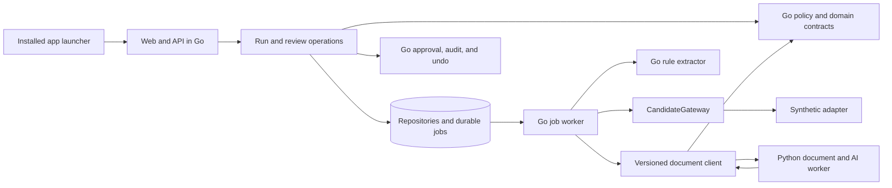

# Boundaries, scaling, and live integration

The Go core is a modular monolith. `domain` imports neither storage nor HTTP code.
`policy` defines missing values and evidence requirements. `pipeline` produces
proposals. `connectors` own candidate access. `jobs` coordinates bounded work,
`audit` owns decisions and writes, and `storage` owns the SQL transaction boundary.
The web layer calls these operations and renders embedded templates.

`application` initializes those services and owns graceful HTTP and job-worker
shutdown for both hosts. `desktop` adds per-user storage, an operating-system
process lock, a local port, and browser opening. It shares the web interface and
business operations with the development command; installation adds no policy
or database schema. The launcher can be replaced with a native window later
without changing extraction, review, or connector modules. Packaged hosts include
SQLite, assets, and Country rules and run without a separate development runtime.

Python is a separate document/AI service with a narrow HTTP contract. It cannot
access application storage or write candidates. Version 1 accepts bounded plain
text and returns deterministic residence proposals; it has no PDF, OCR, vision,
or paid model integration. Go binds responses to candidate/source IDs, validates
quotes and country values, and checks permitted residence evidence. A future model
adapter needs its own policy and evaluation work before changing this behavior.

## Guarantees implemented now

- Country-only Preview/Review requests reject unsupported fields and modes.
- Preview never mutates a profile. Decisions require a completed Review run.
- Empty means null or whitespace. Placeholder values are preserved.
- Proposals quote source text verbatim; conflicts require a correction note.
- Approval reserves suggestion state, checks fresh evidence and Country, and
  conditionally updates the expected revision and exact original empty value.
- Unselected fields are compared after a write. Any unexpected change rolls back
  the candidate, suggestion state, write record, and audit event together.
- Approval and undo have one effect under concurrent submissions. Undo restores
  the exact original empty value only while Country and revision remain unchanged.
- Claims have tokens and expiring leases. Workers renew healthy claims during and
  between extraction requests; obsolete or expired owners cannot commit a page.
  Pause and cancel revoke ownership, and shutdown cancels active requests and
  releases uncommitted pages for recovery without consuming a retry.
- Each page reads a bounded snapshot in a short transaction, extracts outside the
  transaction, then commits proposals, counters, and cursor together under the lease.
- Provider failures and abandoned leases use bounded backoff, stop after five
  attempts, and retain fixed error messages rather than provider error text that
  could contain candidate information.
- Runs capture their initial upper ID; later profiles belong to later runs.
- Go and Python use shared residence-text fixtures, including Unicode whitespace
  and line breaks, while preserving source quotes and validating every proposal.
- Audit pagination uses timestamp and event ID together and preserves timestamp
  precision, so events with identical timestamps remain reachable.

SQLite uses WAL, foreign keys, a busy timeout, immediate transactions, and bounded
connection pools. Independent connection tests verify claim and review contention.
This is a local prototype, not a multi-host production deployment. The schema is
compatible with the first Python prototype; Go migrations preserve its history.

## Evolving toward 200,000 profiles

1. **Read-only JobAdder adapter in Go.** Implement official OAuth, token refresh,
   regional URLs, pagination, and account field/picklist discovery. Start with the
   [Kano reference](kano-reference.md), keeping browser SPA and public API contracts
   separate. Country name and code are one logical field; either populated component
   blocks a missing-field fill.
2. **Account-wide throttling.** Share one request budget across workers. Honor `429`
   and `Retry-After`, bound concurrency, and leave room for other integrations.
3. **Document processing in Python.** Add attachment ownership/type checks, document
   hashes and source dates, PDF parsers, OCR/vision adapters, retention, model schemas,
   cost accounting, and an evaluated set of CVs. Avoid arbitrary first-attachment
   selection. Python returns evidence and proposals; Go retains write authority.
4. **Remote write durability in Go.** Validate public update and conditional-write
   semantics. Add persisted stages, idempotency, reconciliation, lease renewal, and
   an outbox for uncertain network outcomes. SQL rollback cannot undo a remote write.
5. **Postgres and distributed workers.** Add a tested adapter, migrations and data
   transfer, verified claims such as `FOR UPDATE SKIP LOCKED`, shared throttling, and
   several-process tests. Changing a connection string is not sufficient.
6. **Team deployment.** Add authentication, authorization, account boundaries,
   secret management, service authentication, observability, backups, and deployment
   configuration before exposing either service beyond loopback.

Re-run caching, source freshness, and a live write circuit breaker belong to the
integration stage. Go improves internal type checking and core deployment; API
budgets, extraction quality, and durable orchestration still determine practical scale.
