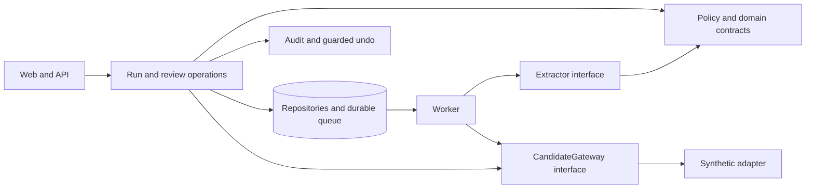

# Boundaries, scaling, and live integration

`contracts` is the shared vocabulary. It must not import the delivery layer, ORM,
or vendor SDKs. `policy` controls what is missing and verifies source evidence.
`pipeline` produces proposals, never writes candidates. `connectors` implement candidate
access; the synthetic adapter does not imitate an unverified JobAdder API. `jobs`
orchestrates bounded reads and stores suggestions. `audit` owns approval and undo.
`storage` is the concrete database adapter, including its transaction boundary.

## Guarantees implemented now

- Only Country is a valid run field. Unsupported fields and modes fail validation.
- A preview cannot approve or reject a proposal; approvals require a completed Review run.
- All source quotes must occur verbatim in the relevant source. Conflicts have no
  automatically chosen value; corrections require an audit note.
- Approval checks current evidence and current Country, then performs a conditional
  update on the candidate revision and empty Country. Other fields are compared afterward.
- The synthetic update, suggestion state, write-back record, and audit event share one
  transaction. A failed check rolls back all four.
- Approval and undo reserve their state atomically. Retrying or concurrently submitting
  a review cannot cause a second effect.
- Undo restores the exact original empty value only while the approved value and
  resulting candidate revision still match. Even an unrelated edit conservatively blocks undo.
- Page results and checkpoints commit together. A page whose lease expired rolls back.
  Claims use a token, expiration, conditional update, and a unique run/candidate/field key.
- Failed pages retry with bounded exponential delay; after five failures the run stops.
  Resume retains its cursor. Error messages record the error type rather than source data.

## Evolving toward 200,000 profiles

1. **Read-only live connector.** Implement OAuth and the region-specific API base URL;
   verify actual Country/custom-field mappings and pagination from the official API.
   Use streaming pages, not a list containing the whole account.
2. **Account-wide throttling.** All workers must share one account budget. Honor `429`
   and `Retry-After`, bound concurrency, and leave capacity for other integrations.
3. **Remote-job durability.** Live API calls must occur outside long database transactions.
   Add persisted stage transitions, idempotency keys, lease renewal, and an outbox with
   reconciliation for the uncertain outcome of a network failure after a remote write.
   A local transaction cannot roll back an already committed JobAdder request.
4. **Postgres and workers.** Add the supported driver, test migrations and data transfer,
   use `FOR UPDATE SKIP LOCKED` claims or a verified queue adapter, and test several worker
   processes. Keep per-account throttling global. SQLite claim tests are not this validation.
5. **Document and model adapters.** Add document hashes, source dates, retention, parsers,
   LLM schemas, cost accounting, Batch API processing, and a hand-verified evaluation set.
   Keep source selection and field-specific freshness rules in the policy/pipeline boundary.
6. **Team deployment.** Add authentication, authorization, account isolation, secret
   management, observability, backups, and deployment configuration before shared access.

Re-run caching and a live write circuit breaker belong to the integration stage.
No artificial full-backlog performance or real-data accuracy claims are made for the demo.
The first version proves the workflow and local safety policy with reproducible tests.
